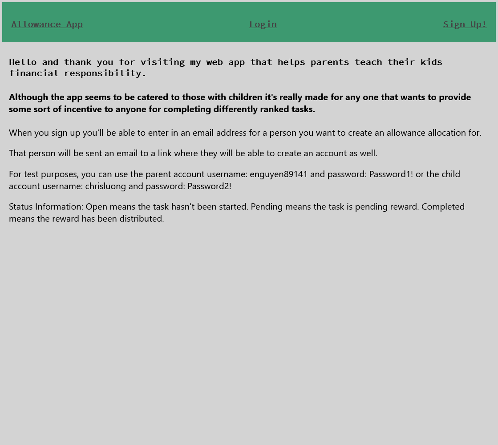
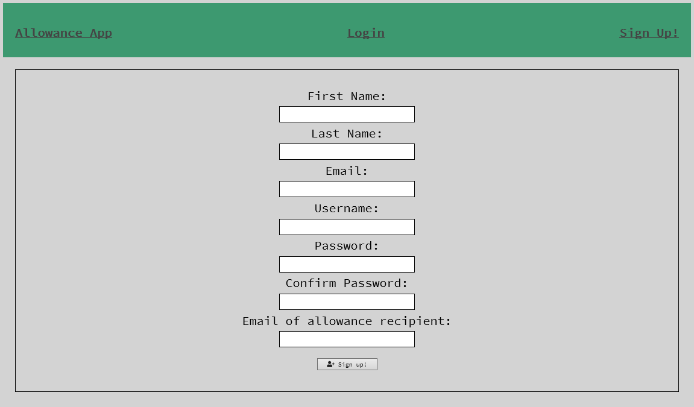
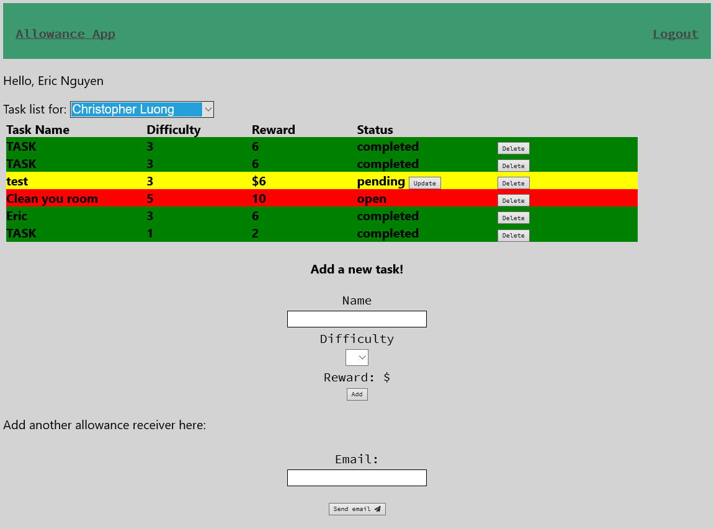
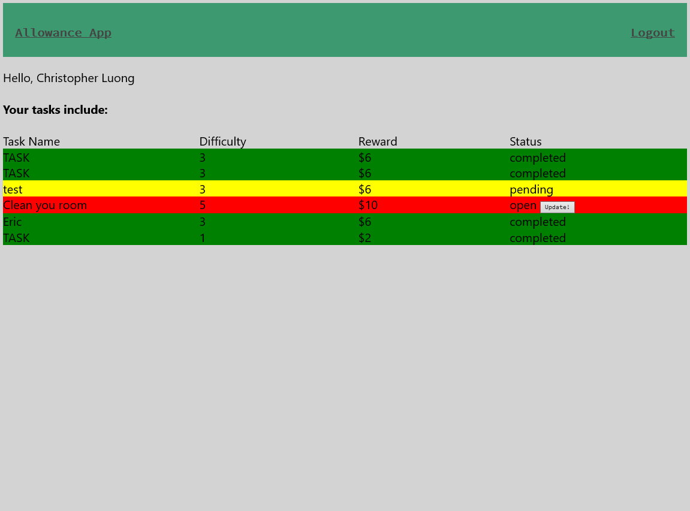

## [Allowance-App](https://allowance-app.enguyen89141.now.sh/)

* This app connects to my [Allowance App API](https://github.com/enguyen89141/allowance-app-api) which includes more documentation
### Summary
* This app gives users the ability to sign up and allocate tasks to someone they want to begin earning an allowance. 
* Users can sign up and an email will be sent to the recipient to create a username and password.
* When looking at the code itself you'll see that the components are utilized in the routes which are similar to views in an MVC framework where the models are the microservices and contexts that speak to my API, views are controlled by react since it's a client side language, and controllers are the routes/components. 
* The contexts are used in order to pass along state information that can be utilized across different routes in the application.
* The services contain methods for authentication and communication with my backend API. 

## Technology Used
* This app utilizes HTML/CSS, ReactJS, Node.js, Express, PostgreSQL, as well as JWT authentication. 

### Screenshots
1. Welcome page  
 
2. Sign up page  
 
3. Parents task list page  
 
4. Child task list page  
 
